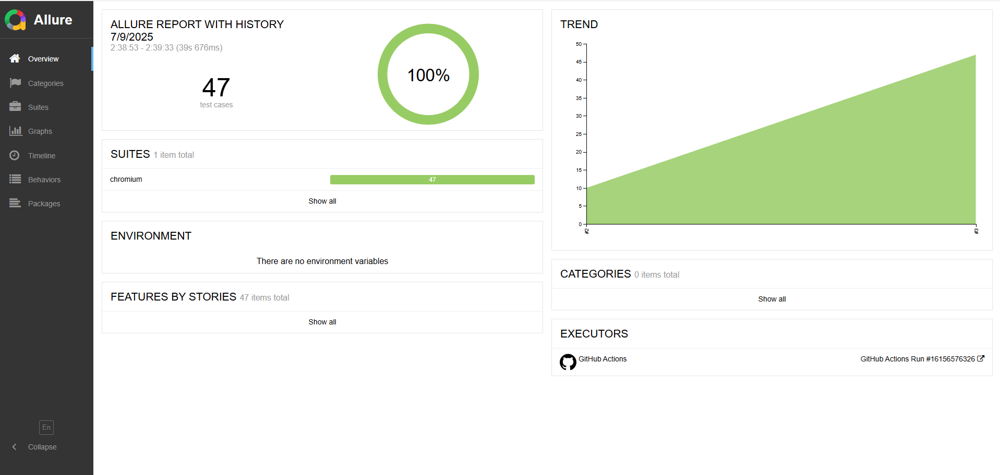
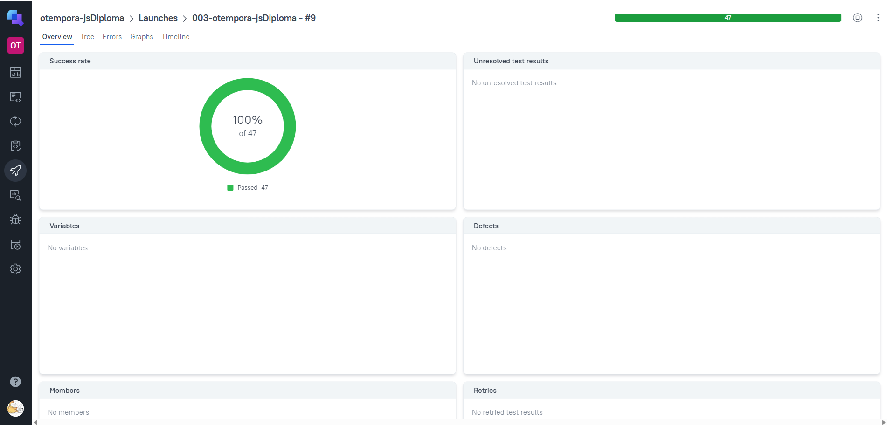
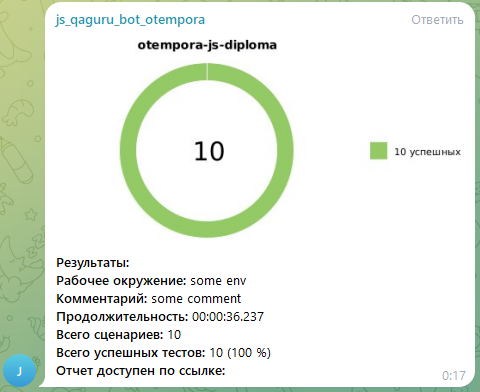

# Дипломный проект, собранный на основе курса по автоматизации тестирования на JavaScript + Playwright

## Содержание
- [Описание](#Описание)
- [Технологический стек](#Технологический-стек)
- [Запуск тестов через Jenkins](#Запуск-тестов-через-Jenkins)
- [Локальный запуск тестов и генерация отчётов](#Локальный_запуск-тестов-и-генерация-отчётов)
- [Пример сформированного allure отчёта](#-Пример-сформированного-allure-отчёта)
- [Отчёт в Allure TestOps](#-Отчёт-в-Allure-TestOps)
- [Уведомления в Telegram](#-Уведомления-в-Telegram)


## Описание
Дипломный проект, выполненный в рамках курсов по автоматизации тестирования. В этом репозитории собраны UI и API-тесты, написанные на JavaScript с использованием Playwright. Для CI/CD задействован Jenkins, который обеспечивает выполнение автотестов, генерацию Allure-отчетов, взаимодействие с TestOps и рассылку уведомлений в Telegram.

В качестве объектов тестирования используются:

**academubugs.com** — веб-сайт, предоставляющий функционал для практики автоматизации ui тестов.

**apichallenges.herokuapp.com** — тренировочный сервис, предназначенный для отработки навыков автоматизации api тестов.

## Технологический стек


## Запуск тестов через Jenkins
Для запуска тестов необходимо авторизоваться на сайте Jenkins, перейти в нужную джобу и нажать Build Now. 
После завершения сборки будет сформирован Allure-отчет, содержащий детальную информацию о результатах тестирования.
Результаты сборки будут автоматически отправлены в Allure TestOps для дальнейшего анализа.
Уведомление о статусе выполнения будет отправлено в Telegram, что позволяет оперативно отслеживать результаты.

## Локальный запуск тестов и генерация отчётов

Команда для локального запуска тестов
```
npm run test
```
Команда для локального формирования отчёта
```
allure generate allure-results -o allure-report
allure open allure-report
```

## Пример сформированного allure отчёта
[Ссылка на отчёт](https://daria1004.github.io/jsDiploma)


## Отчёт в Allure TestOps
[Ссылка на проект](https://allure.autotests.cloud/launch/47233)


## Уведомления в Telegram
